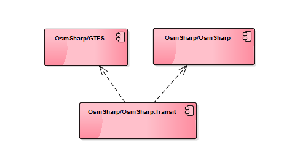

OsmSharp.Transit
================

This projects enables applications based on OsmSharp to add multimodal routing capabilities for Public Transit related applications. It brings togehter the GTFS module and the OsmSharp routing core.



**This is not even remotely stable!**

### Install

Installing OsmSharp.Transit into one of your projects is easiest using Nuget:

```
PM> Install-Package OsmSharp.Transit
```

